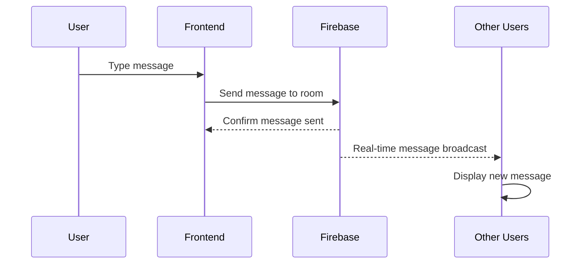
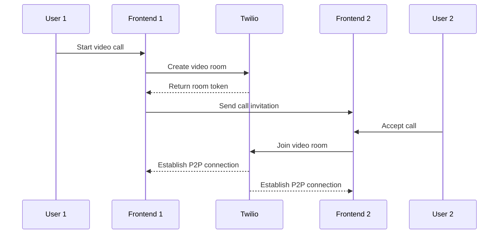

# 🏗️ High-Level Architecture

> System architecture overview for the Video and Chat Application, including infrastructure, services, and data flow.

## 🎯 Architecture Overview

The Video and Chat Application follows a modern cloud-native architecture pattern, leveraging serverless technologies and managed services for scalability, reliability, and cost-effectiveness.

## 🏛️ System Architecture

### Architectural Diagram

```
┌─────────────────────────────────────────────────────────────────────┐
│                          External Services                         │
├─────────────────────────────────────────────────────────────────────┤
│  Google OAuth  │  Twilio Video API  │  Firebase Services           │
└─────────┬───────┴─────────┬─────────┴──────────────┬───────────────┘
          │                 │                        │
          │                 │                        │
┌─────────▼─────────────────▼────────────────────────▼───────────────┐
│                      Client Layer                                  │
├─────────────────────────────────────────────────────────────────────┤
│  React Application  │  Material-UI  │  React Router              │
└─────────┬───────────────────────────────────────────────────────────┘
          │ HTTPS/WSS
          │
┌─────────▼─────────────────────────────────────────────────────────┐
│                     Load Balancer                                │
├─────────────────────────────────────────────────────────────────────┤
│  AWS Application Load Balancer (ALB)                             │
│  • SSL Termination                                               │
│  • Health Checks                                                 │
│  • Multi-AZ Distribution                                         │
└─────────┬───────────────────────────────────────────────────────────┘
          │
          │
┌─────────▼─────────────────────────────────────────────────────────┐
│                   Container Platform                              │
├─────────────────────────────────────────────────────────────────────┤
│  AWS ECS with Fargate                                             │
│  • Auto-scaling Groups                                           │
│  • Service Discovery                                             │
│  • Health Monitoring                                             │
└─────────┬───────────────────────────────────────────────────────────┘
          │
          │
┌─────────▼─────────────────────────────────────────────────────────┐
│                     Data Layer                                   │
├─────────────────────────────────────────────────────────────────────┤
│  Firebase Realtime Database  │  AWS Secrets Manager              │
│  • Chat Messages             │  • API Keys                       │
│  • Room Information          │  • Configuration                  │
│  • User Presence             │                                   │
└─────────────────────────────────────────────────────────────────────┘
```

## 🔧 Technology Stack

### Frontend Layer
```
React Application
├── UI Framework: React 18.2+
├── Styling: Material-UI 5.x
├── Routing: React Router 6.x
├── State Management: React Hooks + Context
└── Build Tool: Create React App
```

### Infrastructure Layer
```
AWS Cloud Platform
├── Compute: ECS Fargate (Serverless Containers)
├── Networking: VPC + ALB + Security Groups  
├── Storage: ECR (Container Registry)
├── Monitoring: CloudWatch Logs + Metrics
└── Security: IAM Roles + Secrets Manager
```

### External Services
```
Third-Party Services
├── Authentication: Google OAuth 2.0
├── Video Services: Twilio Programmable Video
├── Database: Firebase Realtime Database
├── Hosting: Firebase Hosting (Static Assets)
└── Infrastructure: Terraform + Terragrunt
```

## 📊 Architecture Patterns

### Microservices Architecture
The application follows a microservices approach with clear separation of concerns:

| Service | Responsibility | Technology |
|---------|---------------|------------|
| **Frontend Service** | User interface and client logic | React + Material-UI |
| **Authentication Service** | User login and authorization | Google OAuth + Firebase |
| **Chat Service** | Real-time messaging | Firebase Realtime Database |
| **Video Service** | Video calling functionality | Twilio Video API |
| **Infrastructure Service** | Platform and deployment | AWS ECS + Terraform |

### Event-Driven Architecture
```
User Action → Frontend → Firebase → Real-time Updates → All Connected Clients
```

### Serverless-First Approach
- **No server management** - AWS Fargate handles container orchestration
- **Automatic scaling** - Scales from 0 to N based on demand
- **Pay-per-use** - Only pay for actual compute time
- **High availability** - Built-in redundancy and failover

## 🌐 Network Architecture

### Multi-Tier Network Design
```
Internet Gateway
        │
┌───────▼───────┐
│ Public Subnet │  ← ALB (HTTPS Termination)
├───────────────┤
│Private Subnet │  ← ECS Tasks (Application)
├───────────────┤
│   NAT Gateway │  ← Outbound Internet Access
└───────────────┘
```

### Security Zones

| Zone | Purpose | Access |
|------|---------|--------|
| **Public Zone** | Load balancer, internet-facing | HTTPS (443), HTTP (80) |
| **Private Zone** | Application containers | No direct internet access |
| **Management Zone** | Infrastructure services | Administrative access only |

## 🔄 Data Flow

### Real-time Chat Flow


### Video Call Flow


## 📈 Scalability Design

### Horizontal Scaling
- **Container Scaling**: ECS auto-scaling based on CPU/memory
- **Database Scaling**: Firebase handles automatic scaling
- **CDN**: Static assets served via Firebase CDN

### Performance Optimization
- **Container warm-up**: Keep minimum instances running
- **Image optimization**: Lightweight Docker images
- **Caching**: Browser caching for static assets
- **Compression**: Gzip compression for API responses

## 🛡️ Security Architecture

### Defense in Depth
```
┌─────────────────────────────────────┐
│ Application Security                │
│ • Input validation                  │
│ • XSS protection                    │
│ • CSRF protection                   │
├─────────────────────────────────────┤
│ Transport Security                  │
│ • HTTPS/TLS 1.3                     │
│ • Certificate management            │
├─────────────────────────────────────┤
│ Network Security                    │
│ • VPC isolation                     │
│ • Security groups                   │
│ • Private subnets                   │
├─────────────────────────────────────┤
│ Infrastructure Security             │
│ • IAM least privilege              │
│ • Secrets management               │
│ • Container isolation              │
└─────────────────────────────────────┘
```

### Authentication Flow
```
User → Google OAuth → Firebase Auth → JWT Token → Application Access
```

## 🚀 Deployment Architecture

### Environment Separation
```
Development Environment
├── Minimal resources (1 task)
├── Development domain
└── Relaxed security policies

Staging Environment  
├── Production-like setup (2 tasks)
├── Staging domain
└── Production security policies

Production Environment
├── High availability (3+ tasks)
├── Production domain
└── Strict security policies
```

### Infrastructure as Code
```
Terragrunt (Environment Management)
├── Development
├── Staging  
└── Production
    │
    └── Terraform Modules
        ├── VPC + Networking
        ├── ECS + Fargate
        ├── ALB + Security Groups
        └── ECR + Monitoring
```

## 📊 Monitoring Architecture

### Observability Stack
```
Application Metrics
├── CloudWatch Logs (Application logs)
├── CloudWatch Metrics (System metrics)  
├── ALB Access Logs (Request logs)
└── Custom Metrics (Business metrics)
```

### Health Check Strategy
- **ALB Health Checks**: HTTP endpoint monitoring
- **ECS Health Checks**: Container health monitoring  
- **Application Health Checks**: Custom health endpoints
- **External Monitoring**: Uptime monitoring services

## 📚 Architecture Documentation

### Diagrams
- **[Component Diagram](component_diagram.png)** - Detailed component relationships
- **[System Diagram](diagram.jpg)** - Overall system overview

### Related Documentation
- **[Security Architecture](security.md)** - Detailed security implementation
- **[Data Flow](data-flow.md)** - Comprehensive data flow diagrams  
- **[Component Guide](components.md)** - Individual component documentation

---

<div align="center">

**🏗️ Architecture evolves with requirements** - Keep this document updated as the system grows

</div>
