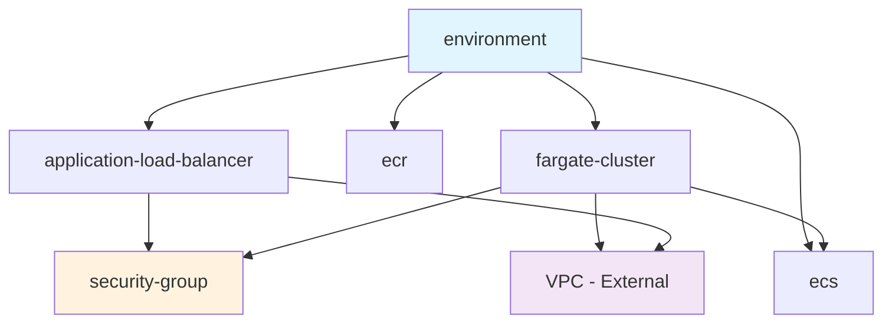

# 📦 Terraform Modules

> Modular, reusable Terraform components for building the Video and Chat Application infrastructure on AWS.

## 🎯 Overview

This directory contains all Terraform modules used to construct the infrastructure for the Video and Chat Application. Each module is designed to be reusable, well-documented, and follows Terraform best practices.

## 🏗️ Module Architecture

```
📦 modules/
├── 🏢 environment/               # 🎯 Main orchestrator
│   └── Coordinates all infrastructure components
├── 🔀 application-load-balancer/ # 🌐 Traffic routing
│   └── HTTPS load balancing and SSL termination
├── 📦 ecr/                      # 🐳 Container storage
│   └── Docker image repository with lifecycle policies
├── 🖥️ ecs/                      # 🏗️ Container orchestration
│   └── ECS cluster with Fargate capacity providers
├── 🚀 fargate-cluster/          # ⚡ Serverless compute
│   └── Auto-scaling containerized applications
└── 🛡️ security-group/           # 🔒 Network security
    └── Flexible security group management
```

## 📋 Module Catalog

### 🏢 Environment Module
**Purpose**: Main orchestrating module that coordinates all infrastructure components

- **Type**: Orchestrator
- **Complexity**: High
- **Dependencies**: All other modules
- **Use Case**: Complete environment deployment

| Feature | Description |
|---------|-------------|
| **VPC Management** | Multi-AZ VPC with public/private subnets |
| **Service Integration** | Coordinates ALB, ECS, ECR, and security |
| **Environment Isolation** | Separate configurations per environment |

[📚 Full Documentation →](environment/README.md)

---

### 🔀 Application Load Balancer
**Purpose**: Provides HTTPS traffic routing and SSL termination

- **Type**: Networking
- **Complexity**: Medium
- **Dependencies**: VPC, Security Groups
- **Use Case**: HTTPS traffic distribution

| Feature | Description |
|---------|-------------|
| **SSL Termination** | HTTPS certificate management |
| **Health Checks** | Application-level monitoring |
| **Multi-AZ** | High availability across zones |

[📚 Full Documentation →](application-load-balancer/README.md)

---

### 📦 ECR (Elastic Container Registry)
**Purpose**: Secure Docker image storage with automated lifecycle management

- **Type**: Storage
- **Complexity**: Low
- **Dependencies**: None
- **Use Case**: Container image repository

| Feature | Description |
|---------|-------------|
| **Lifecycle Policies** | Automatic image cleanup |
| **Vulnerability Scanning** | Security analysis |
| **Access Control** | IAM-based permissions |

[📚 Full Documentation →](ecr/README.md)

---

### 🖥️ ECS (Elastic Container Service)
**Purpose**: Container orchestration cluster with Fargate capacity providers

- **Type**: Compute
- **Complexity**: Medium
- **Dependencies**: None
- **Use Case**: Container cluster management

| Feature | Description |
|---------|-------------|
| **Fargate Integration** | Serverless container hosting |
| **Spot Instances** | Cost optimization |
| **Capacity Strategies** | Automatic resource allocation |

[📚 Full Documentation →](ecs/README.md)

---

### 🚀 Fargate Cluster
**Purpose**: Serverless container deployment with auto-scaling and monitoring

- **Type**: Application
- **Complexity**: High
- **Dependencies**: ECS, ALB, Security Groups
- **Use Case**: Application hosting

| Feature | Description |
|---------|-------------|
| **Auto-Scaling** | CPU/Memory based scaling |
| **Health Monitoring** | Application health checks |
| **Log Management** | CloudWatch integration |
| **Secret Management** | Secure configuration handling |

[📚 Full Documentation →](fargate-cluster/README.md)

---

### 🛡️ Security Group
**Purpose**: Flexible network security rule management

- **Type**: Security
- **Complexity**: Low
- **Dependencies**: VPC
- **Use Case**: Network access control

| Feature | Description |
|---------|-------------|
| **Rule Flexibility** | CIDR and SG-based rules |
| **Multiple Protocols** | TCP, UDP, ICMP support |
| **Dynamic Configuration** | Runtime rule management |

[📚 Full Documentation →](security-group/README.md)

## 🔄 Module Dependencies



## 🎯 Usage Patterns

### 🏗️ Complete Infrastructure (Recommended)
Use the **environment** module for full infrastructure deployment:

```hcl
module "complete_infrastructure" {
  source = "./environment"
  
  environment = "production"
  vpc_CIDR = "10.0.0.0/16"
  # ... other variables
}
```

### 🔧 Individual Components
Use specific modules for targeted deployments:

```hcl
# Just the load balancer
module "alb" {
  source = "./application-load-balancer"
  # ... configuration
}

# Just the container registry
module "registry" {
  source = "./ecr"
  # ... configuration
}
```

## 🚀 Getting Started

### 1. Choose Your Approach
- **New Deployment**: Use `environment` module
- **Existing Infrastructure**: Use individual modules
- **Learning**: Start with simple modules (ECR, Security Group)

### 2. Review Documentation
Each module has comprehensive documentation including:
- Purpose and use cases
- Input variables and outputs
- Usage examples
- Best practices and notes

### 3. Plan Your Architecture
Consider:
- Environment requirements (dev/staging/prod)
- Security requirements
- Scalability needs
- Cost optimization

## 📏 Module Standards

### 🎨 Design Principles
- **Single Responsibility**: Each module has one clear purpose
- **Composability**: Modules work together seamlessly
- **Reusability**: Modules can be used across environments
- **Documentation**: Comprehensive docs for all modules

### 📝 Naming Conventions
- **Files**: Use standard Terraform naming (`main.tf`, `variables.tf`, `outputs.tf`)
- **Resources**: Descriptive names with environment prefixes
- **Variables**: Clear, descriptive variable names
- **Modules**: kebab-case directory names

### 🔧 Best Practices
- **Version Pinning**: Use specific module versions in production
- **Input Validation**: Validate all input parameters
- **Output Documentation**: Document all outputs clearly
- **Error Handling**: Graceful degradation and error messages

## 🧪 Testing

### Module Testing
```bash
# Format all modules
terraform fmt -recursive .

# Validate module syntax
terraform validate

# Plan with example configurations
terraform plan -var-file="examples/development.tfvars"
```

### Integration Testing
```bash
# Test complete environment
cd ../environments/development
terragrunt plan
```

## 🤝 Contributing

### Adding New Modules
1. Create module directory with kebab-case name
2. Implement standard files (`main.tf`, `variables.tf`, `outputs.tf`)
3. Create comprehensive README documentation
4. Add examples and test configurations
5. Update this overview documentation

### Modifying Existing Modules
1. Test changes in development environment
2. Update module documentation
3. Update version compatibility if needed
4. Test with all dependent modules

## 📚 Additional Resources

- [Terraform Module Best Practices](https://developer.hashicorp.com/terraform/language/modules/develop)
- [AWS Provider Documentation](https://registry.terraform.io/providers/hashicorp/aws/latest/docs)
- [Module Testing Strategies](https://developer.hashicorp.com/terraform/language/modules/testing-experiment)

---

<div align="center">

**💡 Need help with a specific module?** Check its individual README or [create an issue](https://github.com/your-username/videoAndChatApp/issues)

</div>
